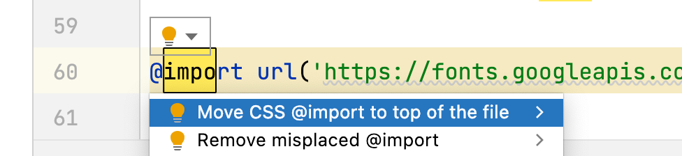

# Grille d'évaluation pour le TP2
- [X] __Balisage sémantique et structurel__ (4 points)
- [ ] __Stratégie d’intégration complétée__
- [X] __Styles CSS (base)__ (2.85/3 points)
    - charte typographique responsive
    - rangées 3-4-5-7-8
- [X] __Styles CSS (défis du header et du footer)__ (.95/1 point)
    - rangées 1-2-6
- [X] __Versionnage__ (1 point)
- [X] __Mise en ligne sur Github Pages__ (1 point)

## Note et commentaires
 9.8 / 10 

- Excellent travail d'intégration. Il n'y a aucune erreur et le balisage est rigoureux.
### CSS
- Il y a de bonnes subdivisions et commentaires pour diviser la CSS.
Il ne manque que de les rapporter dans la table des matières pour que le fichier devienne navigable
- Il manque des styles d'interactivité sur les liens du menu dans le `<footer>`
- Attention, l'importation d'une police de caractère doit se faire au début du fichier CSS avant d'écrire une première règle.

 
## Barème
| Barème | sur 1 |
|--------|-------|
| A+     | 1     |
| A      | 0.95  |
| B+     | 0.9   |
| B      | 0.85  |
| C+     | 0.8   |
| C      | 0.75  |
| D      | 0.65  |
